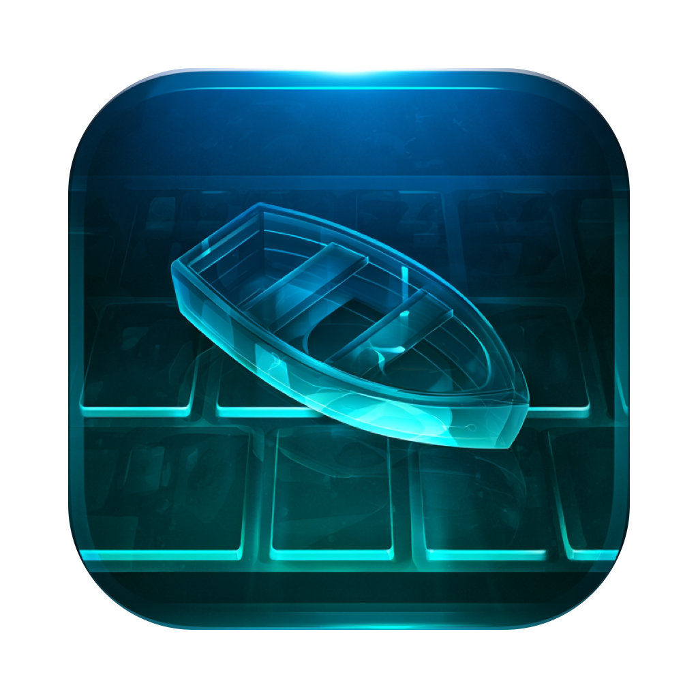

# Rowboat



Keyboard labels for every clickable thing on your Mac. Press a shortcut, type
the label, done. Scroll any pane from the keyboard. Find elements by typing
their text. An open-source, MIT-licensed take on the idea behind
[Homerow](https://www.homerow.app/), built to be boring and reliable.

Status: **v0.1.** All three modes verified on a live desktop in Finder,
Chrome, Safari, Notes and System Settings (see "Verified").

## Modes

| Mode | Default shortcut | What it does |
|---|---|---|
| Click labels | ⇧Space | Labels every clickable element in the frontmost window. Type a label to click it. Shift on the last letter right-clicks, ⌘ command-clicks, ⌥ double-clicks, ⌃ middle-clicks. Backspace edits, Escape leaves. |
| Scroll | ⇧⌘J | Outlines each scroll area with a number. `h j k l` or the arrow keys scroll the selected one, Shift dashes, `d`/`u` half-page, `g g`/`G` top and bottom, Space/⇧Space page, a digit or Tab switches areas. |
| Search | none by default | Type part of an element's title, description or value. The best nine matches get labels 1 to 9; Return clicks the best one. Give it a shortcut in Settings if you want it. |

| Grid | none by default | Click anywhere, even where nothing can be labelled (images, maps, timelines, games, remote desktops). Each letter zooms into a cell; Return or Space clicks the centre (⇧ right, ⌘ command, ⌥ double); arrows nudge, ⇧ arrows nudge further; Delete zooms back out. |

Pressing a mode's shortcut again, or switching apps, leaves the mode. The
keyboard is never left captured: if macOS disables the event tap, Rowboat
re-enables it once and otherwise ends the mode.

Any shortcut can be changed or removed in Settings (click the box, press the
keys, or press Delete for none). A mode without a shortcut is still in the
menu bar menu. A hyper key from Raycast, Karabiner or similar records as
⌃⌥⇧⌘ plus the key and works as a trigger.

What gets a label: buttons, links, fields, rows, cells, menu bar items, and
(by default) static text and images in native apps, so almost anything on
screen can be clicked. Web pages are read through the browser's search
predicate: controls, links, graphics, and named clickable groups such as
cards and list rows. Turn off "Label text and images" in Settings for a
sparser view.

## Install

Rowboat needs macOS 13 or later and the Accessibility permission.

```sh
git clone https://github.com/nathanforster/rowboat   # once published
cd rowboat
scripts/build-app.sh          # produces dist/Rowboat.app
open dist/Rowboat.app
```

Grant Accessibility access when prompted (System Settings → Privacy &
Security → Accessibility). The build is ad-hoc signed, so macOS forgets the
grant whenever the binary changes; re-tick Rowboat after rebuilding, or sign
with your own certificate: `scripts/build-app.sh --sign "Developer ID Application: …"`.

## Develop

Only the Xcode command line tools are required.

```sh
make test                      # RowboatCore unit tests (Swift Testing)
make build                     # debug binary at .build/debug/Rowboat
ROWBOAT_DEBUG=1 make run       # run with logs mirrored to stderr
```

The binary doubles as a developer CLI, which is how the accessibility layer is
verified without clicking around:

```sh
.build/debug/Rowboat --dump com.google.Chrome      # clickable targets of a running app
.build/debug/Rowboat --scroll-areas com.apple.finder
.build/debug/Rowboat --activate hints              # trigger a mode in the running instance
.build/debug/Rowboat --type as                     # post key events (labels, hjkl, "escape")
```

Run the CLI from a terminal that already has Accessibility access, otherwise
every call returns nothing. Logs: `log stream --predicate 'subsystem == "rowboat"'`.

## How it works

- `RowboatCore` is pure Swift with no AppKit: prefix-free label generation,
  typed-prefix matching, fuzzy scoring and label layout. It is fully unit
  tested.
- `Rowboat` talks to the system. `ElementCollector` walks the focused window's
  accessibility tree with one batched attribute fetch per node on a background
  queue, prunes offscreen subtrees and applies node, depth and time limits.
  `OverlayController` draws labels on a click-through panel per screen.
  `KeyCapture` installs an event tap only while a mode is active, so idle typing
  is never delayed. `Clicker` prefers `AXPress` and falls back to synthetic
  mouse events.
- Chromium and Electron apps expose their contents only when asked; Rowboat
  sets `AXEnhancedUserInterface` on them when that setting is on.

The full design, with the measurements behind these choices, is in
[docs/plans/2026-10-05-rowboat-design.md](docs/plans/2026-10-05-rowboat-design.md).

## Verified

Measured on macOS 26 on 2026-10-05 by driving the running app with the
developer CLI and checking screenshots and the target app's state:

| App | Click labels | Scroll | Search | Notes |
|---|---|---|---|---|
| Finder | 50 to 76 targets, 30 to 160 ms; sidebar row click navigated; right-click opened the context menu | 2 to 5 areas | "pict" + Return opened Pictures | column view items via `AXContents` |
| Chrome | Wikipedia article: 169 targets, 72 ms via the search predicate; label pressed the History link | hold j, G, gg all moved the page | 141 targets, 31 ms | tab strip and toolbar labelled too |
| Safari | web area appears once `AXEnhancedUserInterface` is set | 1 area, scrolled | | |
| Notes | 33 targets, 198 ms with 13,000 notes | | | `AXVisibleRows` keeps the walk small |
| System Settings | 30 targets, 184 ms | 2 areas, scrolled | | |

Each release is checked against that list before it is tagged.

## Every visible window

With "Label every visible window" on (the default), a press labels the
active window first and then every other window you can see, each app walked
in its own task and each window clipped to the part not covered by windows
above it. Labels for later windows are appended; the ones already on screen
never change, so you can start typing immediately. Clicking a label in
another app's window brings that window to the front first (switch off
under Labels if you want background clicks that leave focus alone; those
work when the element supports an accessibility press).

## Screen text for apps that expose nothing

Some apps draw their own interface and give the accessibility API nothing to
label: Warp is one, canvases and games are others. For those, Rowboat reads
the window off the screen: a 13 ms capture, then Vision's fast OCR at half
resolution, grouped into phrases, with URLs and paths getting labels of their
own. It runs when an app yields fewer than six targets inside its window or
when the app is listed under Screen text in Settings (Warp is listed by
default). Rowboat pre-reads such an app's window in the background when you switch
to it and shortly after each click in it, so a press usually finds the text
already read (about 30 ms). There is no polling while idle. It needs the Screen Recording
permission, which Rowboat asks for the first time it is needed.

## Side effects worth knowing

- Rowboat asks Chromium, Electron and WebKit apps for their enhanced
  accessibility interface so their pages are labelled. VS Code reacts with a
  "Screen reader usage detected" notice the first time; answer No. Homerow
  does the same and warns that it can cost such apps some performance. Turn
  it off under Apps in Settings if you prefer.
- Scroll mode moves the cursor into the selected area so scroll events land
  there; a hover popover can appear under it. Turn off "Move the cursor to
  the scroll area" to avoid that in apps that route scroll events by event
  location.

## Not yet

Hyper key (Caps Lock remap), input-source switching, menu bar extras, update
checks. No analytics, ever.

## Icon

Generated with Midjourney from a Liquid Glass prompt, then cropped and
masked to the macOS icon shape by `design/make-icon.swift`:

    swift design/make-icon.swift design/icon-source.png 176 176 672 scripts/AppIcon.icns

## License

MIT. See [LICENSE](LICENSE).
